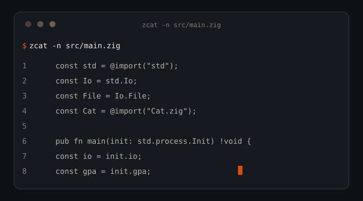

<!--

**Support:** fuel the next build — [](https://buymeacoffee.com/AkashPriyadarshi)
  =============================================================================
  SEO METADATA & KEYWORD INDEX
  =============================================================================
  Title: zcat | Fast Cat Replacement in Pure Zig with JSON Output for AI Agents
  Author: Akash Priyadarshi (@AkashPriyadarshii)
  Description: zcat is a drop-in cat replacement written in pure Zig 0.16.0.
  Zero dependencies, no libc, byte-identical to GNU cat, 12-40% faster.
  JSON output mode built for AI coding agents. Windows, macOS, Linux.

  Keywords: zig, cat clone, gnu cat alternative, cat replacement, command
  line, cli, terminal tools, coreutils, text processing, json output, json
  mode, ai agents, llm tools, agent tooling, token efficient, zero
  dependency, no libc, cross-platform, windows, performance, fast cat,
  96MB benchmark, structured file reads, streaming io, raw syscalls.
  =============================================================================
-->

<div align="center">

# zcat

**Fast `cat` replacement in pure Zig. Byte-identical to GNU cat, 12-40% faster. JSON output for AI agents.**



[](LICENSE)
[](https://ziglang.org)
[](#)
[](#)
[](#performance)

**by [Akash Priyadarshi](https://github.com/AkashPriyadarshii)** · Patna, Bihar, India

</div>

[](https://crates.io/crates/zcat) [](https://crates.io/crates/zcat) [](https://github.com/AkashPriyadarshii/zcat/releases)

---

A drop-in `cat` replacement. Zero dependencies, no libc, pure Zig 0.16.0.
Windows-first, also builds for macOS and Linux.

- **Byte-identical output** to GNU `cat` for `-n`, `-b`, `-s`, `-E`, `-T`.
- **12-40% faster** than GNU cat on a 96MB file (benchmarks below).
- **`--json` mode** for AI coding agents: structured file reads, `\uXXXX`
  escaping, per-file error records, exit code signaling.
- **Zero dependencies.** No libc, no runtime, no containers. One 502KB binary.
- **Streaming I/O, no mmap.** Flat memory at any input size, pipe-safe.

## Contents

- [Why zcat](#why-zcat)
- [Install](#install)
- [Quick Start](#quick-start)
- [Flags](#flags)
- [JSON mode](#json-mode)
- [Performance](#performance)
- [Architecture](#architecture)
- [Agent trilogy](#agent-trilogy)
- [License & Author](#license--author)

## Why zcat

`cat` is the most-piped command in every agent's toolchain, and the stock
binary barely optimizes for it. zcat exists because agents read files in
loops: every token of JSON overhead, every buffered syscall, and every
"is this a directory?" error costs context and time.

- **GNU-compatible, provably.** Line-numbering modes verified byte-for-byte
  against coreutils `cat` 9.x.
- **Agent-first JSON.** One flag gives you `path`, `size`, numbered `lines`,
  escape-safe text, and error records that do not kill the batch.
- **Fast without tricks.** No mmap, no threads, no unsafe. Raw syscalls,
  one 256KB buffer, zero-copy line splitting. Stays flat-memory on a pipe.
- **Exit codes that pipelines respect.** `0` success, `1` file error,
  `141` broken pipe, silent, SIGPIPE semantics.

## Install

```bash
git clone https://github.com/AkashPriyadarshii/zcat.git
cd zcat
zig build -Doptimize=ReleaseSmall
```

Binary: `zig-out/bin/zcat` (`zcat.exe` on Windows, ~502KB).

Windows note: in Git Bash, `zcat` collides with GNU gzip's zcat
(decompressor). Use the full path (`~/.local/bin/zcat.exe`) or install
under that name there.

## Quick Start

```bash
# Plain read (stdin when no file given)
zcat file.txt

# Number all lines, GNU-identical
zcat -n file.txt
     1	hello
     2	world

# Combined short flags
zcat -nbsET file.txt

# Structured read for agents
zcat --json src/main.zig

# Broken pipe: exit 141, silent (SIGPIPE semantics)
zcat b96m.txt | head -c 100
```

## Flags

| Short | Long | Effect |
|-------|------|--------|
| `-n` | `--number` | Number every output line (including blanks) |
| `-b` | `--number-nonblank` | Number non-empty lines only |
| `-s` | `--squeeze-blank` | Collapse runs of empty lines into one |
| `-E` | `--show-ends` | Append `$` to each line ending |
| `-T` | `--show-tabs` | Render tabs as `^I` |
| | `--json` | Structured output for agents (see below) |
| `-h` | `--help` | Usage |
| `-V` | `--version` | Version |

Short flags combine: `-nbsET` works. `-n`/`-b` are last-wins.
`-` reads stdin and can appear anywhere in the file list; multiple files
concatenate in order.

## JSON mode

`--json` wraps output for machine consumption:

```json
{"files":[{"path":"example.txt","size":2048,"lines":[{"n":1,"text":"first line"},{"n":2,"text":"second line"}]}]}
```

- `path` is `"-"` and `size` is `null` when reading stdin.
- Control characters escape as `\uXXXX`. Quotes and backslashes escape.
- Unreadable files emit `{"path":"...","error":"..."}` and processing continues.
- Empty files produce `"lines":[]`.
- Multiple files produce multiple objects in the `files` array.

Designed for AI coding agents that need structured file reads instead of
raw text dumps.

## Performance

96MB file, build `ReleaseFast`, sink `/dev/null`. Median of 3 runs,
compared against GNU coreutils cat 9.x:

| Operation | zcat | cat | Speedup |
|-----------|------|-----|---------|
| Plain copy | 72ms | 82ms | 12% |
| `-n` (number all lines) | 112ms | 185ms | 40% |
| `-s` (squeeze blanks) | 100ms | 145ms | 30% |
| `--json` | 275ms | (no counterpart) | |

## Architecture

- **Raw syscalls, no std buffering.** Windows uses self-declared kernel32
  `ReadFile`/`WriteFile`. POSIX uses `std.posix`. The std.Io reader/writer
  layers are bypassed entirely.
- **Single 256KB read buffer.** Line modes scan chunks in place; complete
  lines are processed directly from the chunk, only partial lines touch a
  small pending buffer (zero-copy feed). Plain mode is one buffer, one loop.
- **No mmap.** Streaming I/O keeps memory flat and works on pipes.
- **Broken pipe exits 141** (SIGPIPE semantics), silently. File errors go to
  stderr as `zcat: file: reason`, processing continues, exit code 1.

```
src/
  main.zig    — entry point, error handling, exit codes
  Args.zig    — CLI argument parsing (+ unit tests)
  Cat.zig     — core logic: reads, line transforms, JSON
build.zig     — Zig build script
build.zig.zon — package metadata
```

## Agent trilogy

File reading, search, and orientation as token-budgeted CLI tools:

- [zcat](https://github.com/AkashPriyadarshii/zcat) — read a file (you are here)
- [rustygrep](https://github.com/AkashPriyadarshii/rustygrep) — find a needle
- [repomap](https://github.com/AkashPriyadarshii/repomap) — orient: where am I, what's here

## Test

```bash
zig build test
```

## License & Author

MIT. Built by Akash Priyadarshi (Patna, Bihar, India).

- GitHub: [AkashPriyadarshii](https://github.com/AkashPriyadarshii)
- Portfolio: [akashpriyadarshi.vercel.app](https://akashpriyadarshi.vercel.app)
- LinkedIn: [akashpriyadarshii](https://linkedin.com/in/akashpriyadarshii)
- Resume: [akashpriyadarshii.github.io/Resume](https://akashpriyadarshii.github.io/Resume/)

More from the ecosystem: [design-genius](https://github.com/AkashPriyadarshii/design-genius) · [akash-design-engineering](https://github.com/AkashPriyadarshii/akash-design-engineering) · [tdlib-android](https://github.com/AkashPriyadarshii/tdlib-android) · [kharcha](https://github.com/AkashPriyadarshii/kharcha)

Social: [X/Twitter](https://x.com/Akash__ydv001) · [Threads](https://www.threads.com/@free_dev2026) · [Instagram](https://www.instagram.com/akash.priyadarshii/) · [Reddit](https://reddit.com/user/DragonfruitWeak2801)